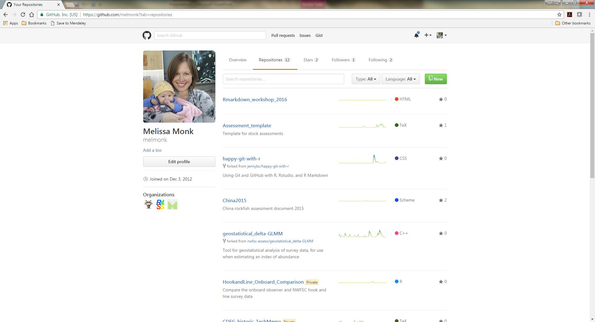
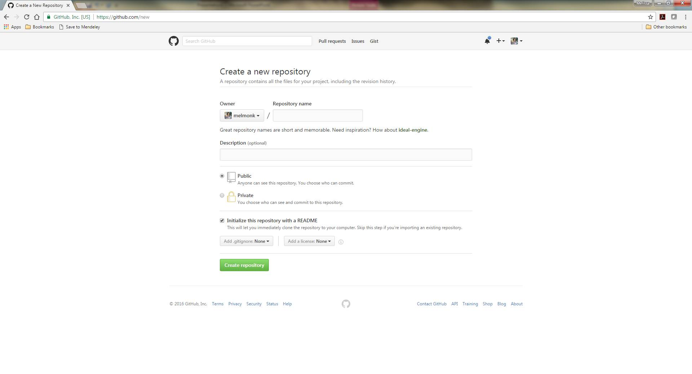

How to Use the Assessment Template 
========================================================
author: Melissa Monk
date: October 2016
autosize: true

Assessment Template: The Details
========================================================
We'll walk through 

- How to get a copy of the repo

- How to incorporate your assessment

- Major sections of the document

- Iserting tables
  - via R code chunks and txt files
  
- Inserting figures
  - via r4SS output and image files
  
- Literature cited

Create your assessment repository
========================================================
From your GitHub account, click Repositories

Click the green "New" button

Create your assessment repository
========================================================
Name the new repository something intuitive such as CASCORP2017

Leave the repo as public unless you plan to use a private repo

Check the "Initialize this repository with a README"

Clone the repo 
========================================================
- If you haven't already done so, clone the Assessment_template repo
to you account.

- In GitHub, you can rename the repo to reflect your assessment, ex. "CAscorp2017"

- In your account, click "Clone or Download" to copy the repo location.

- Now, open RStudio, *File -> New Project -> Version Control -> Git*

- Copy the repo location in the *Repository URL* field.

- Edit the "Project directory name" and "Create project as subdirectory of"
as you wish

- Click *Create Project*

Suggesting changes to the template
========================================================

All master changes will be made to Assessment_template.  If there are
update to Assessment_template, you should be able to pull those changes
to your clone.

If you'd like to suggest a change, you can fork the Assessment_template
and submit a pull request.  HOWEVER, I'd like to hold off on this during 
the assessment cycle.

Feel free to submit an Issue on GitHub, and we'll likely get to them after
the STAR panels.

The YAML
========================================================
left: 60% 
**Each line is described in the ReadMe PDF**

title: 'Status of Blue Rockfish (*Sebastes mystinus*) Along the U.S. Pacific Coast in x2015x'   
author: ''    
date: ''   
output:   
&nbsp;&nbsp;  pdf_document:    
&nbsp;&nbsp;&nbsp;    fig_caption: yes   
&nbsp;&nbsp;&nbsp;    highlight: haddock   
&nbsp;&nbsp;&nbsp;    includes:   
&nbsp;&nbsp;&nbsp;&nbsp;      before_body: Titlepage.tex   
&nbsp;&nbsp;&nbsp;&nbsp;     in_header: header.tex    
&nbsp;&nbsp;&nbsp;    keep_tex: yes    
&nbsp;&nbsp;&nbsp;    latex_engine: xelatex    
&nbsp;&nbsp;&nbsp;    template: Default_template_modified.tex   
&nbsp;&nbsp;&nbsp;    number_sections: yes   
&nbsp;&nbsp;&nbsp;    toc: yes   
&nbsp;&nbsp;&nbsp;    toc_depth: 4   

***
documentclass: article
fontsize: 12pt   
geometry: margin=1in   
csl: CJFAS.csl   
bibliography: BibFile.bib

